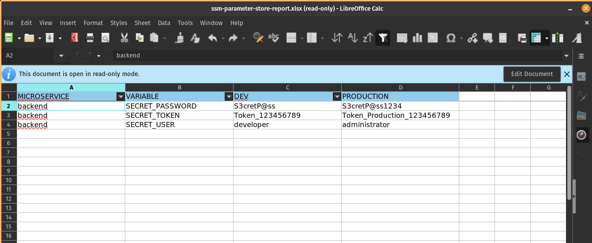

# Demo SSM Parameter Store Secure String with Cloudformation

Environment variables to deploy the demo stack

```
INFRA_STACK_NAME=demo
ENVIRONMENT=dev
KMS_KEY_ALIAS=KmsKeyAlias
REGION=us-east-1
```

Deploy Kms Key stack for encryption secret strings in parameter store

```
aws cloudformation create-stack \
    --region $REGION \
	--stack-name $INFRA_STACK_NAME-kms-key \
	--template-body file://./kms-key.yml \
	--capabilities CAPABILITY_IAM CAPABILITY_NAMED_IAM \
	--parameters \
	ParameterKey=KmsKeyAlias,ParameterValue=$KMS_KEY_ALIAS 
```

AWS doesn't allow the creation of secret string variables via Cloudformation, however we can use a lambda function as a custom resource that will allow us to create these secrets: 

```
aws cloudformation create-stack \
    --region $REGION \
	--stack-name $INFRA_STACK_NAME-cr-ssm-helper \
	--template-body file://./cr-ssm-helper.yml \
	--capabilities CAPABILITY_IAM CAPABILITY_NAMED_IAM \
```

Create secret variables for Dev Environment

```
# Dev Environment

ENVIRONMENT=dev
aws cloudformation create-stack \
    --region $REGION \
	--stack-name $INFRA_STACK_NAME-ssm-variables-backend \
	--template-body file://./ssm-variables-backend.yml \
	--parameters \
	ParameterKey=Environment,ParameterValue=$ENVIRONMENT \
	ParameterKey=KmsKeyAlias,ParameterValue=$KMS_KEY_ALIAS 
```

Create secret variables for Prod Environment

```
# Prod Environment

ENVIRONMENT=prod
aws cloudformation create-stack \
    --region $REGION \
	--stack-name $INFRA_STACK_NAME-ssm-variables-backend-prod \
	--template-body file://./ssm-variables-backend.yml \
	--parameters \
	ParameterKey=Environment,ParameterValue=$ENVIRONMENT \
	ParameterKey=KmsKeyAlias,ParameterValue=$KMS_KEY_ALIAS 
```

Query environment variables by path 

```
CONFIG_ENV="/backend/$ENVIRONMENT/"
aws ssm get-parameters-by-path \
    --path $CONFIG_ENV \
    --query 'Parameters[*].[Name,Value]' \
    --with-decryption \
    --region $REGION \
    --output text | \
	awk -F ' ' '{print $1"="$2}' | \
	sed -e "s|$CONFIG_ENV||g"
```

Query environment variables as environment variables

```
aws ssm get-parameters-by-path \
    --path $CONFIG_ENV \
    --query 'Parameters[*].[Name,Value]' \
    --with-decryption \
    --region $REGION \
    --output text | \
	awk -F ' ' '{print $1"="$2}' | \
	sed -e "s|$CONFIG_ENV||g" | \
	while read var; do export $var; done

```


### Generate a spreadsheet report in excel format 


```
cd parameter-store-report
DOCKER_IMAGE="parameter-store-report"
docker image rm $DOCKER_IMAGE || (echo "Image $DOCKER_IMAGE didn't exist so not removed."; exit 0)
docker build . -t $DOCKER_IMAGE
docker run --rm -v $HOME/.aws/credentials:/root/.aws/credentials:ro -v $(pwd):/app/output $DOCKER_IMAGE
```




### Delete cloudformation stack
```
aws cloudformation delete-stack \
    --region $REGION \
	--stack-name $INFRA_STACK_NAME-ssm-variables-backend-prod

aws cloudformation delete-stack \
    --region $REGION \
	--stack-name $INFRA_STACK_NAME-ssm-variables-backend

aws cloudformation delete-stack \
    --region $REGION \
	--stack-name $INFRA_STACK_NAME-cr-ssm-helper

aws cloudformation delete-stack \
    --region $REGION \
	--stack-name $INFRA_STACK_NAME-kms-key
```
